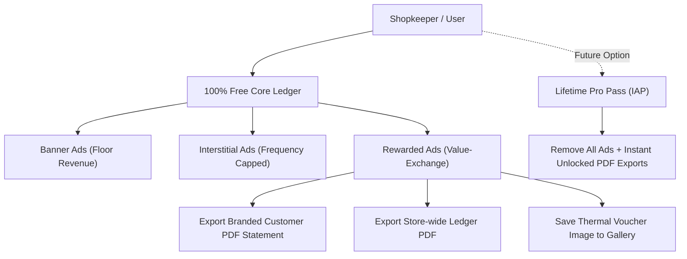

# Baki Khata (বাকির খাতা) — Monetization Strategy & Technical Architecture

> **Document Purpose**: Official monetization strategy and architecture documentation for **Baki Khata**, submitted for the Ostad AI App Development Capstone Assignment (*"Google Play Console-এ App Publish এবং Monetization"* — 20 Marks).

---

## 1. Executive Summary

**Baki Khata** is an offline-first digital ledger and credit management application built for micro-merchants, local grocers (*Mudi dokan*), wholesalers, and small businesses in Bangladesh. 

Local shopkeepers require an app that is fast, reliable in areas with intermittent connectivity, and free from financial friction. Placing high upfront paywalls or aggressive subscriptions would severely harm adoption. Therefore, **Baki Khata** adopts a **Hybrid Value-Exchange Monetization Model** powered by **Google AdMob In-App Advertising (IAA)**, with a clear roadmap for **Lifetime Pro In-App Purchases (IAP)**.



---

## 2. Target Market & User Persona Analysis

| Attribute | Characteristics & Pain Points | Monetization Fit |
| :--- | :--- | :--- |
| **User Persona** | Neighborhood grocery shopkeepers, pharmacy owners, electronics retailers in Bangladesh. | High resistance to monthly recurring subscriptions (SaaS). |
| **Usage Pattern** | Rapid transaction entry during rush hours; ledger auditing and customer reminders during quiet afternoon/evening hours. | Fast entries must never be blocked or lagged by ads. |
| **High-Value Moments** | End-of-month debt collection, issuing formal receipts, auditing total outstanding dues. | Ideal moment for voluntary rewarded video ads. |

---

## 3. Ad Format Strategy & Placement Architecture

### A. Persistent Bottom Anchored Banner Ads (Baseline Floor Revenue)
* **Ad Unit**: Google AdMob Adaptive Banner (`ca-app-pub-3940256099942544/6300978111`)
* **Placement**:
  - Docked directly above the `BottomNavigationBar` in `MainNavigationScaffold` across Dashboard, Customers, and History tabs.
  - Docked at the footer of `CustomerDetailsScreen`.
* **Rationale & UX**:
  - Banner ads provide consistent, steady impressions as shopkeepers switch between tabs and review balances.
  - Sits securely docked without obscuring Floating Action Buttons or data input fields.
  - On Flutter Web (`kIsWeb`) or when offline, the widget automatically collapses to `SizedBox.shrink()` to preserve screen real estate.

### B. Post-Action Interstitial Ads (Natural Transition Breaks)
* **Ad Unit**: Google AdMob Interstitial Ad (`ca-app-pub-3940256099942544/1033173712`)
* **Placement**:
  - Triggered immediately after a transaction is successfully written to the database in `TransactionDialog`.
* **UX Safeguards & Frequency Capping**:
  - **Interval Capping**: Displayed strictly on **every 3rd transaction save** (`_transactionActionCounter % 3 == 0`).
  - **Time Cooldown**: Enforces a minimum **90-second cooldown** between interstitial impressions.
  - **Policy Rule**: Never shown during app launch (cold start), while entering numbers, or abruptly while reading customer records.

### C. Rewarded Video Ads (Value-Exchange Model)
* **Ad Unit**: Google AdMob Rewarded Video (`ca-app-pub-3940256099942544/5224354917`)
* **Placement**:
  - Customer Statement Export & Print (`StatementExportSheet`).
  - Store-wide Summary Statement Export & Print (`StoreStatementExportSheet`).
* **Value-Exchange Mechanism**:
  - Shopkeepers can freely view summaries and calculate balances inside the app.
  - When generating and sharing a high-resolution, branded PDF Statement (with shop logo, signature line, and Bangla font rendering), a friendly modal dialog prompts:
    > *"Watch a brief sponsor video to export and share your official branded PDF statement for free."*
  - **Highest eCPM**: Rewarded video ads yield 4x–8x higher eCPMs than standard banners in South Asian markets.
  - **Offline / Error Fallback**: If the device is offline or the ad network fails to serve a video, feature access is **immediately granted** to ensure the shopkeeper is never prevented from serving their customer.

---

## 4. Technical Architecture & Safety

The monetization architecture is decoupled from business logic and encapsulated in `lib/core/ads/`:

```
lib/core/ads/
├── ad_unit_ids.dart                     # Centralized Google test & production unit IDs
├── ad_service.dart                      # Singleton ad lifecycle manager with frequency caps
└── widgets/
    ├── anchored_banner_ad.dart          # Self-managing banner widget with auto-sizing
    └── rewarded_ad_prompt_dialog.dart   # Branded dual-language (EN/BN) prompt dialog
```

### Key Technical Pillars:
1. **100% Web Isolation (`kIsWeb`)**:
   `google_mobile_ads` does not execute on Flutter Web. Every ad component guards against web execution, enabling the live Vercel web deployment (`https://baki-khata-eosin.vercel.app/`) to compile and function seamlessly.
2. **Pre-Caching Strategy**:
   Both Interstitial and Rewarded ads are pre-cached in memory upon app startup so they render with zero latency when triggered.
3. **Automated Test Immunity**:
   All 123 automated unit and widget tests run without depending on native AdMob binaries, ensuring full CI/CD regression safety.

---

## 5. Google Play Policy Compliance & Privacy

1. **Non-Financial App Classification**:
   Baki Khata is a personal/business digital ledger and record-keeping tool. It is **not** a money lending, micro-credit, or peer-to-peer loan app.
2. **Third-Party Ad Disclosures**:
   The app's public Privacy Policy hosted at `https://baki-khata-eosin.vercel.app/privacy` explicitly discloses Google AdMob SDK analytics and ad identifiers in full accordance with Google Play Developer Policy.
3. **No Deceptive Placements**:
   Ads are never placed near tap targets to induce accidental clicks, and clear test labels (`Test Ad`) are maintained during all testing and Play Console evaluation phases.
